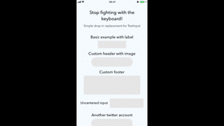

# React Native Spotlight Input

Simple drop-in replacement for React Native `<TextInput>` that makes you forget the keyboard.



## Installation

```
yarn add react-native-spotlight-input
```

## Usage

```js
import TextInput from 'react-native-spotlight-input'

<TextInput
  ...
  overlayColor="#0496FF"
  header={() => <Text>Header</Text>}
  footer={() => <Text>Footer</Text>}
/>
```

### Props

#### `overlayColor`

Defines the background color when focused

#### `header`

Is a component (could be either function or class component) that takes `inputValue` as a prop.

```js
const Header = ({ inputValue }) => <Text>You are writing this: {inputValue}</Text>

<TextInput
  ...
  header={Header}
/>
```

#### `footer`

Is a component (could be either function or class component) that takes `inputValue` as a prop.

```js
const Footer = ({ inputValue }) => <Text>You are writing this: {inputValue}</Text>

<TextInput
  ...
  footer={Footer}
/>
```
